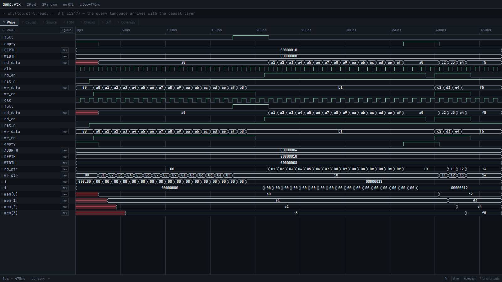
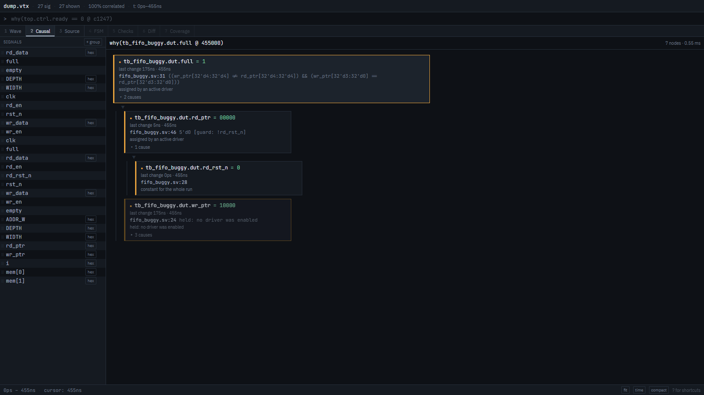
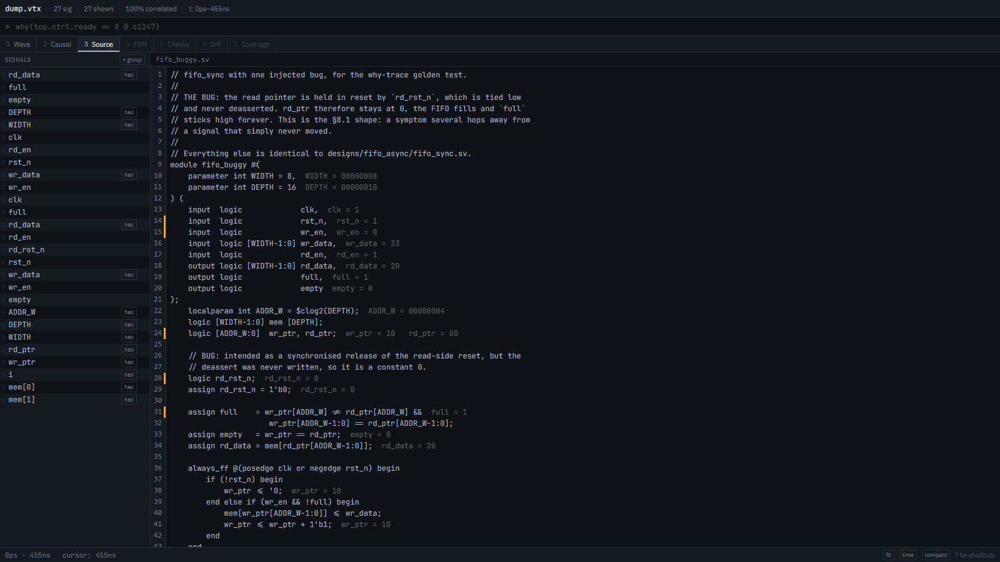

# VeriTrace

**A simulation failed. VeriTrace tells you why.**

```
$ veritrace triage sim.log
19 failure(s) in log -> 1 root cause(s)

[1] 19 failure(s)  -  tb_fifo_buggy.dut.rd_rst_n = 0 [constant] at c27   fifo_buggy.sv:30
      log:4  ERROR: assertion "p_fifo_drains" failed at time 275ns
      log:6  ERROR: assertion "p_fifo_drains" failed at time 285ns
      ... and 17 more
      why(tb_fifo_buggy.dut.rd_rst_n @ 275000)
```

Nineteen failing assertions, one tied-low reset, and a file and line to go fix.
No waveform opened, no signal named by hand.

VeriTrace is an RTL verification hub built entirely on free tooling — Icarus,
Verilator, ModelSim Starter, Vivado xsim. It parses SystemVerilog into a causal
signal-dependency graph, correlates that graph with a simulation trace, and
answers *"why does this signal have this value"* with a deterministic,
reproducible chain that ends at a line of source.

---

## Install

```sh
pip install veritrace
```

Nothing else. The wheel carries the Rust trace engine and the web interface.

Python 3.12 – 3.14.

<details>
<summary>From a checkout</summary>

The Rust extension links against a real interpreter, so the virtualenv has to
be **activated** before `pip` runs — otherwise the build targets whatever Python
is on `PATH`.

```powershell
uv venv --seed --python 3.12 .venv
.venv\Scripts\Activate.ps1      # PowerShell — `activate` alone is the bash script
python -m pip install -e .
cd web; npm install; npm run build   # builds the UI into the package
```

```sh
# bash / zsh
uv venv --seed --python 3.12 .venv
source .venv/bin/activate
pip install -e . && (cd web && npm install && npm run build)
```

`python -c "import sys; print(sys.executable)"` should print a path inside
`.venv`. If it does not, the activation did not take and the build will use the
wrong interpreter.

The supported Python range is set by PyO3, which refuses to compile against a
CPython newer than it knows about. `requires-python` in `pyproject.toml` and the
`pyo3` version in `crates/vt-py/Cargo.toml` are kept in step, so pip declines
an unsupported interpreter with a readable message instead of starting a source
build that ends in a wall of Rust output.
</details>

## The first sixty seconds

If you have RTL and no waveform yet — which is where every project starts — one
command does the whole thing:

```sh
$ veritrace run rtl/
  7 source file(s), top module 'tb_cpu'
  simulated with Icarus Verilog in 1.4 s
  waveform: .veritrace/dump.vcd (512 signals)
  correlation: 487/512 signals (95.1%)

  2 stuck · 1 x sources · 4 lint
    ! top.arb.lock_r  frozen at 1 since c12   arb.sv:88

  Wrote .veritrace.toml - later commands need no arguments.
  veritrace serve .veritrace/dump.vtx --rtl rtl/
```

Drop your files in a folder and point at it. It works out the top module,
simulates, converts, and reports — and **a testbench with no `$dumpfile` still
produces a waveform**, because a generated module is compiled alongside it
rather than your sources being edited. Everything lands in `.veritrace/`.

`--fail-on stuck,x,cdc` makes the same command a CI gate, and `--serve` opens
the interface when it finishes. Only Icarus is driven from here; the other three
simulators keep their `make sim-<tool>` recipes, where their mandatory flags
already live.

<details>
<summary>If a waveform already exists</summary>

```sh
$ cd ~/projects/my_cpu
$ veritrace init
  Found 14 RTL file(s)
  top module: detected 'tb_cpu' - use this? [Y/n]
  clock signal: detected 'clk' - use this? [Y/n]
  reset signal: detected 'rst_n' - use this? [Y/n]
  Wrote .veritrace.toml

  Trace found: sim/dump.vcd
    converted to sim/dump.vcd.vtx - 512 signals
    correlation: 487/512 signals (95.1%)
    2 stuck - 1 x sources - 4 lint
      ! top.arb.lock_r  frozen at 1 since c12   arb.sv:88
      ! top.cpu.regfile  register with no reset, never written   regfile.sv:21
      ... 4 more in the Checks tab

$ veritrace serve
```

`init` guesses everything it can from the RTL — the module nobody instantiates
is the top, the signal in the first `@(posedge X)` is the clock — and writes a
complete `.veritrace.toml` so you never type the same six arguments twice.
Then it runs the checks on whatever dump it finds, because the first impression
should be *"it already knows something I didn't"*, not an empty config file.
</details>

## Where the trace comes from

This matters more than anything else in the tool: **the hierarchy in the trace
has to match the hierarchy in the RTL**, or correlation fails and every answer
after it is built on sand. `make sim-<tool>` has the flags right for all four.

| Simulator | Keeps hierarchy? | What it needs |
|---|---|---|
| **Icarus Verilog** | Yes, completely | nothing — the primary target |
| **Verilator** | **No, by default** | `-fno-inline --public-flat-rw --trace-max-array 1024` |
| **ModelSim** (Quartus Lite) | Yes, with `+acc` | `vsim -voptargs="+acc"` |
| **Vivado xsim** | Yes | `xelab -debug typical` |

Verilator inlines modules and deletes intermediate wires; ModelSim's optimiser
hides internal signals. Both are the same trap in different clothing, and both
are silent. `veritrace correlate` is how you find out:

```sh
$ veritrace correlate dump.vcd --rtl rtl/
93/96 signals correlated (96.9%)
  by method: exact=91, elements=2, not_traced=3
  2 not dumped but reconstructible from RTL:
    ~ tb_lanes.dut.g_lane[2].u_fifo.mem
```

The rate is a first-class number and what it could not place is named, rather
than quietly matched on a suffix.

## What it does

### Ask why

```sh
$ veritrace why dump.vcd --rtl rtl/ "why(tb.dut.full == 1 @ c45)"
tb_fifo_buggy.dut.full = 1   [assigned] at c45   fifo_buggy.sv:33
     ((wr_ptr[4] != rd_ptr[4]) && (wr_ptr[3:0] == rd_ptr[3:0]))
  -> tb_fifo_buggy.dut.rd_ptr = 00000   [assigned] at c45   fifo_buggy.sv:48
       5'd0   [guard: !rd_rst_n]
    -> tb_fifo_buggy.dut.rd_rst_n = 0   [constant] at c45   fifo_buggy.sv:30
```

The graph comes from **pyslang's elaborated AST** — generate blocks expanded,
parameters resolved, instance arrays unrolled — so `top.g_lane[2].u_fifo.wr_ptr`
already reads the way the trace spells it. Each driver carries the guard it
fires under, accumulated down the AST with consumed `else` branches negated:

```
wr_ptr   guard !rst_n                      -> 5'd0
wr_ptr   guard rst_n && wr_en && !full     -> wr_ptr + 1
```

Three rules keep the answers honest:

- **Registers are explained at their clock edge**, with inputs read *before* it.
  Sampling at the edge gives "state is WAIT because next_state is WAIT" when
  next_state has already moved on.
- **"Constant for the whole run" only ends the chain when the RTL says the
  signal cannot change.** A register that merely never fired is the symptom, and
  stopping there would make the root cause depend on which simulator produced
  the dump.
- **Ordering is a heuristic; the tree is complete.** Causes are ranked by oldest
  last transition — what has not moved is the suspect — but every branch is
  present and expandable, so the result is deterministic.

### Find what is wrong before you ask

Opening a session runs every check with no prompting, because this is what turns
a debugger into something used daily:

```
▾ STUCK (7)
    tb.dut.lock_r        frozen at 1 since c4    (324 cycles)          [why]
▾ X SOURCES (1)
    tb.dut.uninit        register with no reset, never written         [why]
      └─ reaches tb.acc, tb.dut.acc, tb.dut.u_dut.acc
▾ LINT (10)
    tb.dut.status        parity (clk) crosses into status (slow_clk)   [why]
      └─ sampled in the risky window 4x in this trace, at c8, c25, c42, c76
      └─ Structural check: not formal CDC sign-off.
▾ PARAMETERS (1)
    tb.dut.u_dut.DEPTH   DEPTH = 4 left at its default
```

The lint is deliberately narrow. Generic lint is done better by Verilator and
slang, so VeriTrace **aggregates them** rather than competing, and implements
natively only the class that needs *both* the graph and the trace — the
"works in simulation, fails on the board" bugs:

| | |
|---|---|
| Inferred latch, incomplete case, multiple drivers | from slang's dataflow analysis |
| Blocking in `always_ff`, non-blocking in `always_comb`, incomplete sensitivity list | from the graph |
| Unsynchronised CDC, async reset with no synchronous deassert | from the graph, **with the cycles where the trace shows it actually sampled in the risky window** |
| Dependence on an initial value, X-optimism | from the graph **and** the trace |

That last column is the point. A static tool can tell you a crossing exists; it
cannot tell you it was sampled at c8, c25, c42 and c76 in the run you just did.

Every row has an exact source location and a working `[why]`. Suppressing one
requires a reason, and the suppression lives in the session file so it survives
re-running the simulation.

**Honesty about CDC**: the check is *structural* — it finds a crossing with no
two-flop synchroniser. It is not formal CDC sign-off: no reconvergence analysis,
no handshake-protocol proof, no glitch analysis. It catches the common real bug
(a signal passed straight between domains) and does not replace a dedicated tool
on a production design. That paragraph is attached to every CDC finding, not
buried here.

### Narrow 4000 signals to 8

```sh
$ veritrace cone dump.vcd --rtl rtl/ top.ctrl.ready --depth 4 --active-only
fanin cone of top.ctrl.ready, depth 4: 11 signal(s)
  38 dropped as inactive in the window
```

Backward BFS answers "what could have produced this", forward answers "if I
change this, what breaks". Intersecting with the signals that actually toggled
in the visible window removes the resets, straps and clocks that are in every
cone and never the answer.

### Feed the viewer you already use

You are not going to abandon GTKWave, so VeriTrace feeds it instead of competing
with it. **Any** analysis can be written as a save file:

```sh
veritrace why   ... --gtkw   > cone.gtkw    # GTKWave
veritrace cone  ... --do     > cone.do      # ModelSim
veritrace stuck ... --wcfg   > cone.wcfg    # Vivado xsim
veritrace why   ... --surfer > cone.surf    # Surfer
```

```tcl
# cone.do, generated — run it directly in ModelSim
add wave -group "Causal chain" -radix hexadecimal /tb/dut/ctrl/ready
add wave -group "Causal chain" /tb/dut/arb/lock_r
wave cursor add -time 1247ns -name "root cause"
```

Someone who never opens the VeriTrace UI still gets most of the value from one
command. This has been verified in real ModelSim (Quartus Prime Lite 20.1), not
just against a format description: the file loads with zero errors and the
signals carry the values VeriTrace reported.

### Work in transactions, not in `awvalid`

Nobody debugging an interconnect thinks in `awvalid`. They think "write 128 took
22 cycles". A **protocol pack** is a TOML file that says how to lift signals into
transactions, and the extraction engine that reads it knows nothing about any
protocol:

```sh
$ veritrace txn dump.vtx --rtl rtl/
3 interface(s) - 40 transactions

m0    [AXI4-Lite]   tb_axi_arb.m0
    clock tb_axi_arb.m0.aclk   reset tb_axi_arb.m0.aresetn   236 cycles sampled
    10 WRITE   (30/30 channel events correlated, 100%)
    table: dump.vtx/txn/m0.parquet
```

Interfaces are detected automatically — a pack lists the signals it needs and the
prefixes to try, so nothing has to be configured per project. `axi4`, `axi4lite`
and `handshake` ship with the tool; a new protocol is one file and about thirty
minutes.

Then query them:

```sh
veritrace txn dump.vtx "txn(m0, type=WRITE, addr=0x4000:0x5000)"
veritrace txn dump.vtx "txn(m0) | slowest(10)"
veritrace txn dump.vtx "txn(m0) | open()"     # never completed
```

Each interface's table is written to `dump.vtx/txn/<iface>.parquet`, which is
both the cache and the export: a colleague can plot latency without this tool,
without an API and without asking you.

```python
import polars as pl
pl.read_parquet("dump.vtx/txn/m0.parquet")
```

### Cross from a signal into the transaction holding it up

This is the part nothing else does. When a causal chain reaches a signal that
belongs to a known interface, it checks whether a transaction is in flight there
and carries on at that level:

```sh
$ veritrace why dump.vtx "why(txn.m0.WRITE[0].not_issued)" --rtl rtl/
WRITE#0 on m0 was issued at c116; this is why it was not issued earlier, in c0-c116

tb_axi_arb.m0.awvalid = 0   [assigned] at c57
  ...
    -> tb_axi_arb.arb.grant = 01        (lock ? owner : pick)
      -> tb_axi_arb.m1.awvalid = 0
        -> [txn] m1.WRITE[4]
             m1: WRITE#4 still in flight here (addr=0x0)
          -> tb_axi_arb.s_bvalid = 1
            -> tb_axi_arb.slv.bvalid   [guard: ... && (wcnt >= 4'd8)]
              -> [txn] slv.WRITE[4]
```

Three levels of abstraction in one answer: master 0's signal, master 1's
transaction, and the slave transaction that one is waiting on. A signal-level
answer stops at `grant != 0` — true, and useless.

Protocol rules from the pack are checked while extracting, and violations arrive
in the Checks tab alongside the latches and the stuck signals:

```sh
veritrace check dump.vcd --rtl rtl/ --fail-on protocol
```

### Configure the capture before the bug

```sh
veritrace probes top.ctrl.ready --depth 3 --format vivado  > ila_probes.tcl
veritrace probes top.ctrl.ready --depth 3 --format quartus > stp_probes.tcl
```

The signals in the causal cone are exactly the ones worth probing, so this is a
direct translation. It needs only the graph — no trace, no capture — which makes
the tool useful *before* the bug, when the ILA is being configured and the
choice of probes actually costs a board iteration to get wrong.

## The interface

```sh
veritrace serve dump.vcd --rtl rtl/
```

Opens on **Checks** when there is something to report and on **Wave** when there
is not, because an empty tab is exactly the blank canvas to avoid.

### Wave



Traces are drawn on an **OffscreenCanvas inside a Web Worker** — never the DOM,
which dies at a few thousand signals. The main thread stays out of the render
loop: pan and zoom go from the wheel event straight to the worker, so React
never re-renders during a scroll. Measured at **0.67 ms average, 0.80 ms p95**
per frame over 40 rows, against the 16.7 ms that 60 fps allows.

Monochrome by design — colour is reserved for causality. The only exceptions are
the logic-analyser conventions: X in red, Z in violet. A value containing X or Z
is never rendered as a number.

Scroll pans, `⌃scroll` zooms, `⇧scroll` moves vertically; `⌘P` finds a signal,
`w` asks why about the selection, `?` lists every shortcut. Layout, groups,
radix, zoom and cursors save themselves and come back exactly as you left them.

### Causal



The chain as a column of cards, symptom at the top, root cause at the bottom.
Right-click a signal in Wave → *Why is this value here?*, or click `[why]` on
any finding. Secondary branches are collapsed and dimmed rather than hidden.

### Source



CodeMirror 6 with an amber gutter on the lines of the current chain, and a value
inlay beside every line showing what its signals hold **at the cursor time**.
Move the cursor in Wave and the numbers follow. Click an identifier to add it to
Wave; alt-click to ask why.

Editing RTL after a run is caught by a sha256 recorded with the session — a
banner, never a block.

### Transactions

A Gantt band per transaction over **Wave's own time axis** — the same view, so a
band and the handshake below it stay aligned at every zoom level. Colour means
what it means everywhere else: amber only for a transaction in the current
causal chain, magenta only for one that broke a protocol rule.

Clicking a band filters Wave to that interface's signals and jumps to its
window. Below it, every field and metric the pack defines, sortable. A
transaction that never completed gets a `why` that asks the right question.

A design with two or more interfaces opens on this tab rather than on Checks.

### Performance

The tab for the two daily questions: **why is it slow** and **why did it stop**,
answered with attributed numbers rather than impressions.

Every clock cycle gets exactly one label from a cascade the protocol pack
defines — `reset`, `transfer`, then the pack's own reasons in priority order,
then `other`. The shares add to **exactly 100%**, and the total is printed next
to the chart so it can be checked rather than trusted. `other` is a bucket of
its own on purpose: it means the *pack's* cascade has a gap, which is a
different fact from a bus that was idle, and merging the two would hide the only
signal that says the attribution is incomplete.

```
node0.m
    608 cycles sampled, 599 lost (99%)
      reset              0.7%  ............................  4
      transfer           0.8%  ............................  5
      address_stall     97.5%  ###########################.  593
      response_wait      0.8%  ............................  5
      idle               0.2%  ............................  1
      = total          100.0%
```

Beside it: a latency histogram with p50/p95/p99 and a clickable tail, outstanding
over time with a plateau called out when the series has found a ceiling, and a
fairness bar per master with Jain's index.

Deadlock, livelock and starvation are scans over the same transaction table, so
they run when the session opens — like the stuck detector — and appear in Checks
as ordinary findings. A wait-for cycle is reported the way §8.18 writes it, with
**real wires** rather than abstractions, and a `why` on every link:

```
DEADLOCK at c25, persistent 582 cycles

  node0.m  waits on  tb_deadlock.node0.m_awready  held by  node0.s
  node0.s  waits on  tb_deadlock.node0.s_awready  held by  node0.m
                                     `-- cycle

  Cycle of 2 agents. First blocked: WRITE#5 could not be issued at c25
```

Naming who holds a wire is a question about the design, so it needs RTL. Without
it the blockages are still listed and the report says why they have no holder,
rather than guessing one.

### Memory

Everything about an SDRAM controller in the vocabulary it is actually debugged
in — banks, rows, commands and timing — decoded from the command bus alone. No
simulator support, no testbench code, and no SDRAM model needed: the controller
driving the bus is the whole device under test.

A memory pack replaces `[[channel]]`/`[[transaction]]` with a decode table, and
the shipped one is §8.20's own:

```toml
[[command]]
name   = "ACTIVATE"
encode = { cs_n = 0, ras_n = 0, cas_n = 1, we_n = 1 }
args   = { bank = "ba", row = "a" }
```

The **timing checker** is the reason this exists — a violated `tRCD` corrupts
data intermittently and takes weeks to find by hand. All twelve constraints of
§8.20 are checked against a per-chip file in `packs/timing/`, and the report
names both commands and the exact cycle rather than saying something looks
wrong:

```
ctrl   [mt48lc16m16a2]   4 banks   13 commands
    ! tRCD violated 1 time(s)
        c9   bank 0  ACTIVATE@c8 -> READ@c9  (1 cycles, min 2)
    ok  tRAS, tRC, tREFI, tRRD, tRTP, tWR, tWTR: conformant
```

The constraints that *held* are listed too: "conformant" is a fact worth
stating, and an absent line is not one. CL/CWL say why they were not checked
rather than being reported as passing — measuring data latency needs a DQ
signal a pin-level pack does not declare.

Beside it: a **bank timeline**, one row per bank on Wave's own time axis, with
the open row labelled — and it shows what the controller *did*, so a segment
cut short by a too-early ACTIVATE stays cut short. A searchable **command
stream**, row **hit/miss/conflict** rates, and an **address-map inspector**
that decomposes an address into (bank, row, column) using the ranges the pack
states.

A design with a memory interface opens on this tab (§11.4b).

### Check the data arrived

*I wrote `0xDEADBEEF` to `0x4000` through the DMA. What reached memory?*

Every write transaction on every interface updates a byte-granular `addr →
value` model, and every read is compared against it. It is a scoreboard with no
testbench written, and it runs when the session opens:

```sh
$ veritrace track dump.vcd
dma.s_axi   [AXI4-Lite]   8 write(s), 8 read(s), 32 byte(s) compared
mem         [AXI4-Lite]   8 write(s), 8 read(s), 16 byte(s) compared
    path dma.s_axi -> mem: 8 write(s) matched by address and order

! 16 data mismatch(es)
    c8   dma.s_axi -> mem  0x0  byte(s) 0-1
        byte(s) 0-1 were enabled upstream and not downstream
    c58  dma.s_axi  0x0  byte(s) 0-1
        read back 0xdead0000 where 0xdeadbeef was written
```

Two answers, and the second is the one that saves the week: *which bytes*, and
*where in the path they changed*. The value is never what is followed — the same
word appears a thousand times in a real trace — so what is followed is the
**(address, sequence)** pair, and two interfaces are compared only when their
write address sequences are identical. That rule is what keeps two unrelated
masters that happen to share an address from being reported as corruption.

```sh
veritrace track dump.vcd "track(addr=0x10)"
veritrace track dump.vcd "track(from=src, to=sink)"   # a stream: order, not address
```

For a stream with no address, the check is the other one §8.19 names: the n-th
word in must be the n-th word out. Reordering, duplication, loss and words that
were never sent are told apart rather than merged.

Mismatches arrive in Checks as ordinary findings, at ERROR without qualification.
A latch might not matter; a word that came back different always does.

### See what you did not test

One tab, two sections, because they answer one question. **Functional coverage
is computed from the extracted transactions** — no covergroup, no simulator
feature, nothing to write:

```sh
$ veritrace coverage dump.vcd --rtl rtl/
cpu   [AXI4-Lite]   24 transactions   47%
    bresp                  field     2/4
        never: EXOKAY
        never: DECERR
    kind                   sequence  2/4
        never: READ x READ
        never: WRITE x WRITE
    partial_write          corner    0/1
        never: hit   a write that did not enable every byte lane
```

The bins come from the pack's declared domain, so a value that never occurred is
an **empty box rather than a missing row** — which is the whole point. A `[[cover]]`
entry is a field, a cross, a consecutive-pair matrix or a corner, and a corner is
an expression, so the engine still knows no protocol:

```toml
[[cover]]
corner = "burst_crosses_4k"
when   = "(addr % 4096) + (awlen + 1) * (1 << awsize) > 4096"
```

**Code coverage is imported**, from Verilator or from Vivado — both are valid
sources and neither is required:

```sh
verilator --binary --coverage --coverage-line rtl/*.sv tb.sv && ./obj_dir/Vtb
veritrace coverage dump.vcd --coverage logs/coverage.dat --rtl rtl/
```

And an uncovered point becomes the conditions that would close it, derived from
the graph rather than suggested:

```
fifo_buggy.sv:49 [branch]
    else if (rd_en && !empty) rd_ptr <= rd_ptr + 1'b1;
    rd_rst_n            NEVER observed
        <- rd_rst_n <= 0
    rd_en               24/46 cycles
    !empty              44/46 cycles
```

Three conjuncts, two of them routinely true, one never — and the assignment that
makes it never. That is the injected bug, reached from a coverage hole.

## The `.vtx` store

A directory of Parquet plus one binary index, so the data is usable without this
tool:

```python
import pyarrow.parquet as pq
pq.read_table("dump.vtx/events/")     # (signal_id, time, delta, value)
```

`index.bin` is the only proprietary piece; Parquet gives scans, not `value_at`
in O(log n). Two rules the store is built around:

- `value_at(sig, t)` returns the **last** write at `t` — the settled value,
  never an intermediate delta-cycle glitch. Glitches stay reachable through
  `deltas_at` / `value_at_delta` rather than being discarded.
- `value_before(sig, t)` gives the value strictly before `t`. For
  `always_ff @(posedge clk) q <= d`, `d` may change at the same timestamp as the
  edge, so sampling it *at* the edge yields "q is 1 because d is 0".

```python
from veritrace import TraceStore
s = TraceStore("dump.vtx")
h = s.handle("tb.dut.wr_ptr")
s.value_at(h, 25000), s.value_before(h, 25000), s.deltas_at(h, 25000)
```

## Command reference

```sh
veritrace run   rtl/ [--top X]      # simulate + convert + check, in one command
veritrace init                      # detect everything, write .veritrace.toml
veritrace serve [trace] --rtl src/  # the interface
veritrace triage sim.log            # log -> root causes
veritrace why   trace "why(sig @ cN)"       [--json|--do|--gtkw|--wcfg|--surfer]
veritrace why   trace "why(txn.iface.WRITE[n].not_issued)"
veritrace cone  trace sig --depth N --direction fanin|fanout|both [--active-only]
veritrace stuck trace --cycles N
veritrace txn   trace ["txn(iface, type=WRITE) | slowest(10)"]
veritrace perf  trace ["stalls(iface)" | "deadlock()" | "latency(iface, by=master)"]
veritrace memory trace ["cmds(iface)" | "banks(iface)" | "timing(iface, chip=…)"]
veritrace track trace ["track(addr=0x10)" | "track(data=0x…)" | "scoreboard(iface)"]
veritrace coverage trace ["fcov(iface)" | "uncovered()"] [--coverage logs/coverage.dat]
veritrace check trace --fail-on stuck,x,cdc,protocol,deadlock,memory,integrity  # the CI gate
veritrace probes sig --format vivado|quartus
veritrace correlate trace --rtl src/
veritrace convert dump.vcd -o dump.vtx
```

Every command accepts a raw `.vcd`/`.fst` and converts it on the way in, and
falls back to `.veritrace.toml` for the trace, the RTL and the top module.

## In CI

```yaml
- run: veritrace check dump.vcd --rtl rtl/ --fail-on stuck,x,cdc,protocol
- run: veritrace triage sim.log --trace dump.vcd --rtl rtl/
```

A failing build then carries the cause in its log rather than a dump nobody will
open. This repository does it to itself: `.github/workflows/ci.yml` runs `check`
and `triage` against the designs with deliberately injected bugs and fails if
the tool stops finding them.

## Reference designs

| | |
|---|---|
| `designs/fifo_async` | a clean synchronous FIFO — the baseline, 100% correlated |
| `designs/fifo_buggy` | the same FIFO with `rd_rst_n` tied low, plus the log it produces |
| `designs/lanes` | a for-generate and an instance array — the correlation stress case |
| `designs/checks` | **eleven deliberate flaws**, one per check ([README](designs/checks/README.md)) |
| `designs/axi_lite` | a correct AXI4-Lite master and slave — the transaction fixture ([README](designs/axi_lite/README.md)) |
| `designs/axi_arb` | two masters, an arbiter and real starvation ([README](designs/axi_arb/README.md)) |
| `designs/deadlock` | two nodes waiting on each other — the bug is one `define` away from being gone ([README](designs/deadlock/README.md)) |
| `designs/sdram` | an SDR SDRAM command bus with four injected timing violations, one per category ([README](designs/sdram/README.md)) |
| `designs/dma` | a DMA path whose byte-enable mask drops two lanes — also one `define` from being clean ([README](designs/dma/README.md)) |

## Status

Usable as a causal debugger, as a daily checker, and as a transaction-,
performance- and memory-level debugger. VCD parsing, the `.vtx` store,
value-at-time queries, a FastAPI server with downsampled streaming, the RTL
graph and correlation layer, why-trace, stuck / X-prop / cone / lint / parameter
checks, log triage, viewer and probe export, protocol packs with automatic
interface detection and rule checking, transaction-level why-trace, stall
attribution and the liveness scan, SDRAM command decode with the twelve timing
constraints, the automatic data-integrity scoreboard, and functional coverage
from transactions with code coverage imported from Verilator or Vivado — and the
Wave, Causal, Source, Checks, Coverage, Transactions, Performance and Memory
tabs.

Not yet: diff, FSM extraction.

Measured on a 50 MB / 3.6 M-event synthetic dump over 5000 signals, against the
tier-A budget:

| Operation | Measured | Budget |
|---|---|---|
| VCD → `.vtx` conversion | 5.0 s | < 6 s |
| `value_at` (warm) | 0.5 µs | < 5 µs |
| Session open | 10 ms | < 1 s |
| `why()` on the reference design | 3–9 ms | < 150 ms |
| All checks on a 330-cycle design | 12 ms | — |
| Extracting 3 interfaces, 236 cycles | 25 ms | — |
| Wave frame, 40 rows | 0.67 ms avg | < 16.7 ms |

### FST support

Off by default. `fstapi` compiles libfst from C and needs zlib plus libclang; on
Linux that is `zlib1g-dev` and `libclang-dev`, on Windows it additionally wants
a vcpkg install. VCD — the primary target — needs nothing extra.

```sh
cargo build --features vt-trace/fst
```

### A note on `$dumpvars`

Dumping unpacked-array elements needs `$dumpvars(1, dut.mem[0])`, which the LRM
does not allow and only Icarus accepts. The reference testbenches guard it with
`` `ifdef __ICARUS__ ``. VeriTrace also defines `VERITRACE` during elaboration,
so `` `ifndef VERITRACE `` hides anything else from the graph without affecting
simulation.

## Development

```sh
make test        # cargo test + pytest + vitest
make test-web    # Playwright, needs `make serve-rtl` running
make bench       # the tier-A budget
make designs     # re-simulate every reference design
```

**668 tests**: 70 Rust, 490 Python, 38 Vitest, 70 Playwright — with the
acceptance criterion of each stage tested rather than asserted.
